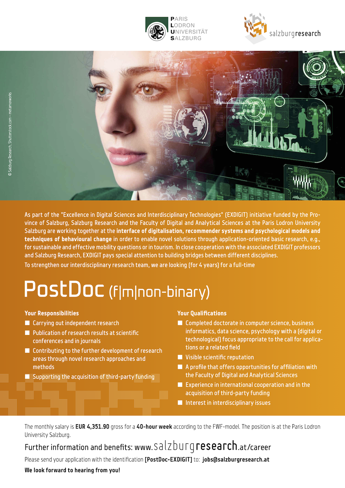

To strengthen our interdisciplinary research team, we are seeking a full-time PostDoc for 4 years.  
This position is part of a collaboration of [Salzburg Research](https://www.salzburgresearch.at/en/) and the [Faculty of Digital and Analytical Sciences](https://www.plus.ac.at/digital-and-analytical-sciences/?lang=en) at the University of Salzburg---as part of the 'Excellence in Digital Sciences and Interdisciplinary Technologies' (EXDIGIT) initiative.  
We are working together at the interface of digitalization, recommender systems, and psychological models and techniques of behavioral change. In an application-oriented basic research endeavor, this position is intended to put a particular focus on questions regarding sustainable and effective mobility and/or tourism.

This position is embedded in the EXDIGIT Research College with ample room for interdisciplinary collaborations beyond the mentioned focus.

[Full vacancy description (in English)](./job_postdoc.pdf) 

For questions related to the position, feel free to address me directly via e-mail. I am happy to chat if you are at RecSys 2023 and interested in the position.  
Applications have to be sent to the e-mail address as specified in the job description.